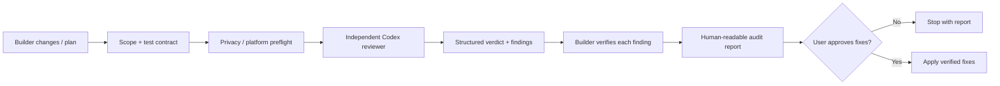

# Case Study — Codex Adversarial Review Lite: Independent AI Review Workflow

## Problem

AI coding agents can produce plausible but wrong implementations, invent APIs, over-expand scope, or validate their own incorrect assumptions. A second chat window helps, but it is easy to skip privacy checks, scope control, test expectations, mutation checks, or human approval.

The goal was to turn **independent second-model review into a repeatable engineering workflow** rather than an informal prompt habit.

Public repository: [codex-adversarial-review-lite](https://github.com/razaumair2203-ux/codex-adversarial-review-lite)

## Core idea

**Claude builds. Codex audits.**

The builder and reviewer are deliberately separated. The reviewer receives a scoped review contract and returns findings; the builder then validates each finding rather than blindly applying it. No fix is made until the user signs off.

## Engineering controls

- Independent builder/reviewer roles rather than same-agent self-review.
- Explicit user-approved review scope.
- Test specifications and edge-case fixtures can be attached to the review contract.
- Platform detection for Windows, macOS, Linux, and WSL.
- Reviewer-model preflight and model fallback.
- Git state and dirty-file hash capture before/after reviewer dispatch.
- Reviewer runs without editing project files.
- Structured terminal verdict: `APPROVED` or `REVISE`.
- Builder-side disposition for each finding: accept, reject, re-scope, defer, or verify.
- Report-before-fix flow with optional HTML audit artifact.
- Explicit privacy notice before repository context is sent to the reviewer backend.
- Human approval required before fixes are applied.
- End-to-end self-test for shell, paths, tools, hashes, model access, and dispatch.

## Why this is an AI-engineering project rather than a prompt file

The interesting part is not the instruction “ask another model.” The engineering work is the **control plane around the models**:

- what context is selected;
- how scope is frozen;
- how expected behavior becomes a checkable contract;
- how model/tool availability is preflighted;
- how filesystem mutation is detected;
- how reviewer output is validated;
- how disagreement between agents is handled;
- how the user remains the final authority.

This is the same class of problem that appears in enterprise GenAI systems: model output is one component inside a larger governed workflow.

## What this project proves for an AI engineering role

**GenAI integration:** real model/CLI integration rather than static prompt examples.

**Evaluation mindset:** reviewer output is not trusted automatically; it is independently checked against code, tests, and the approved review contract.

**Responsible AI / secure implementation:** privacy boundary, no silent edits, mutation detection, and explicit human control.

**Production usability:** installer paths, cross-platform behavior, fallback handling, self-test, troubleshooting, and repeatable output format.

**Technical communication:** the public repository explains the system, constraints, known limitations, and operating model so another engineer can actually use it.

## Known limitations / next steps

- Expand from CLI-based model backends to provider/API adapters with a stable interface.
- Build a benchmark corpus of seeded defects to quantify reviewer precision/recall and false-positive behavior across models.
- Add longitudinal evaluation for model-version changes.
- Add optional CI integration while preserving the current human-approval boundary for consequential fixes.

The project intentionally claims **risk reduction, not correctness guarantees**.
