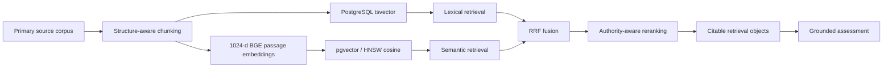

# Lodestar — Inspectable RAG Engineering Evidence

This folder is a sanitized public evidence bundle extracted from the working private **Lodestar** codebase. It exists so a technical reviewer can inspect representative implementation details instead of relying on a résumé claim that says “RAG”.

## What the working system currently contains

| Evidence | Current verified state |
|---|---:|
| Real legal corpus | **209 documents** |
| Retrieval units | **2,945 chunks, all embedded** |
| Grounding evaluation | **34 hand-checked query / expected-citation pairs** |
| Top-5 grounding error | **2.9%** |
| Python/backend automated tests | **53 green** |
| Stress / abuse cases | **17 / 17 pass** |
| Browser E2E | **3 / 3 Playwright flows pass** |
| Concurrent full-flow stress | **12 / 12 pass** |

These figures come from the private project’s locked roadmap and grounding-evaluation log. They are published here as implementation evidence, not as legal-product marketing claims.

## Retrieval architecture

## Representative implementation files

- [`legal_chunking.py`](legal_chunking.py) — deterministic legal-structure-aware chunking; structure first, size second.
- [`embedding_provider.py`](embedding_provider.py) — provider contract, BGE query/passage asymmetry, dimensionality validation, lazy model loading.
- [`hybrid_retrieval.py`](hybrid_retrieval.py) — lexical + vector search, Reciprocal Rank Fusion, authority lanes, reranking, hydration into citable evidence objects.
- [`chunks_schema.sql`](chunks_schema.sql) — PostgreSQL retrieval plane with `pgvector`, HNSW cosine ANN, generated FTS vector, GIN metadata indexes.
- [`grounding-eval.md`](grounding-eval.md) — the current measured retrieval-grounding result.

## Why the design is more than a demo RAG chatbot

### 1. Domain-aware chunking

The source is not split into arbitrary fixed windows. Statutes, regulations, policy material and decisions are divided around actual legal structure, then only split further when a structural unit becomes pathologically large. This preserves meaningful citation units.

### 2. Retrieval is deliberately hybrid

Semantic similarity and lexical matching solve different failure modes. Lodestar runs both, then fuses ranks with Reciprocal Rank Fusion instead of pretending cosine distance and `ts_rank` are directly comparable scores.

### 3. Source authority changes retrieval behavior

A decision-heavy corpus can drown primary authority in semantically similar secondary decisions. The retriever therefore runs additional high-authority lexical/vector lanes so controlling sources enter the candidate pool before reranking.

### 4. Embeddings are provenance-stamped and replaceable

The working architecture treats vectors as a rebuildable cache. The slow-changing asset is the sourced corpus. Embedding provider/model/version/dimension are explicit; model changes require a parallel re-index and grounding regression check rather than silent in-place mutation.

### 5. Grounding is measured

Current measured result: **34 hand-checked query / expected-citation pairs, top-5 error 2.9%** against a **209-document / 2,945-chunk** corpus. This is a real evaluation artifact, not a statement that “responses looked relevant.”

### 6. The system has been stressed beyond happy-path demos

The current private build records **53 pytest checks**, **17/17 abuse/stress cases**, **3/3 Playwright E2E flows**, and **12/12 concurrent end-to-end flows** after connection pooling, batch writes, embedding warm-up/locking, UUID validation and lexical fallback were added in response to observed failures.

## Architecture decisions I would defend in an interview

- Why direct Python/SQL instead of LangChain for a citation-sensitive pipeline.
- Why legal structure beats blind token chunking for this corpus.
- Why the vector index is a derived cache rather than the source of truth.
- Why BGE query/passage encoding is asymmetric.
- Why RRF is used instead of score normalization.
- Why retrieval evaluation is separated from LLM answer-quality evaluation.
- Why model upgrades require re-index + regression evaluation.
- Why unembedded corpora fall back to lexical retrieval rather than blocking the API.
- Why private/candidate evidence and source-law corpora belong in distinct data planes.

## Evidence boundary

The full application repository remains private because it contains product internals and user/candidate-data structures. The files in this folder are selected non-secret implementation artifacts intended specifically for technical review. No credentials, private user data, proprietary employer data or sensitive military material are included.

[Back to Lodestar case study](../../lodestar-rag.md) · [Back to AI portfolio](../../README.md)
