# TIR-FOD / Clear Run — Measured Edge-AI Evidence

This page publishes the measurable engineering evidence behind the TIR-FOD / Clear Run case study. It separates **dataset/model evidence**, **generalization risks**, and **onboard deployment evidence** so the work can be reviewed as an AI engineering system rather than a demo video.

Public dataset: **TIR-FOD v1.2** — [DOI 10.5281/zenodo.22546586](https://doi.org/10.5281/zenodo.22546586)

## Dataset and experiment scale

| Measure | Evidence |
|---|---:|
| Original LWIR runway frames | **3,499** |
| Positive frames | **3,218** |
| Object-free frames | **281** |
| Annotated objects | **5,593** |
| FOD classes | **23** |
| Archival pool incl. stored derivatives | **29,243 images** |
| Model-training runs | **29** |
| Detector families evaluated | **YOLOv8 / YOLO11 / YOLO12** |
| Sensor stream | **640 × 512 LWIR** |

Stored derivatives are explicitly not treated as independent acquisitions.

## Model / data-quality evidence

| Question | Result | Why it matters |
|---|---:|---|
| Best observed detector | **YOLOv8n — 0.8603 ± 0.0017 mAP** | Highest observed benchmark mean with ~3.0M parameters; larger models did not consistently improve the result. |
| Size-sliced AP: small / medium / large | **0.704 / 0.846 / 0.942** | Small FOD remains the hardest regime and cannot be hidden inside aggregate mAP. |
| Annotation agreement — representative imagery | **F1 0.971** | Routine imagery is labeled consistently. |
| Annotation agreement — difficult imagery | **F1 0.645** | Hard scenes retain meaningful localization uncertainty. |
| Leakage / contamination experiment | **+8.52 percentage points invalid uplift** | Related derivatives crossing the train/test boundary can materially inflate reported performance. |
| Acquisition-group split | **0.8223 → 0.7410 mAP** | Separating related capture blocks reduced performance by **8.13 points**, exposing a generalization risk. |
| Stored offline derivatives | **+0.67 ± 0.83 points** | Offline augmentation gave only a modest, seed-dependent mean benefit. |

The important result is not “YOLO works.” It is that **data grouping and source similarity changed measured generalization more than simply scaling model size**.

## Edge deployment evidence

TensorRT inference was deployed onboard an **NVIDIA Jetson Orin Nano** during repeated runway flights at approximately **5–10 m** using a **640 × 512 LWIR** stream.

| Deployment measure | Ten-run / recorded result |
|---|---:|
| TensorRT detector inference | **25.0 FPS** |
| Complete inspection pipeline | **15.6 FPS end-to-end** |
| Compute + camera subsystem | **~17 W** |
| Reported module temperature | **55–70 °C** |

The demonstrator exercised sensing, onboard detection, communications and operator display. Logged behavior included misses, false detections and classification errors; those are treated as engineering evidence, not edited out of the story.

## Evaluation architecture

```mermaid
flowchart LR
    A[LWIR runway capture] --> B[Source/session grouping]
    B --> C[Annotation + independent QA]
    C --> D[Frozen grouped train/val/test]
    D --> E[YOLOv8 / YOLO11 / YOLO12 runs]
    E --> F[Aggregate + size-sliced metrics]
    F --> G[Leakage / acquisition grouping checks]
    G --> H[TensorRT export]
    H --> I[Jetson Orin Nano]
    I --> J[Repeated runway flights]
    J --> K[Inference + E2E + power / thermal evidence]
```

## Engineering decisions visible in the evidence

### Source-grouped evaluation instead of random-image optimism

A runway flight produces highly related frames. Random splitting can leak scene/capture identity across partitions. The experiment therefore measures what happens when related sources are separated and when derivatives improperly cross the holdout boundary.

### Small-object performance is reported explicitly

Runway FOD can occupy very few pixels. AP is therefore sliced by object size; the 0.704 / 0.846 / 0.942 progression makes the operational difficulty visible.

### End-to-end throughput is reported separately from model FPS

A detector benchmark can be fast while the real sensing/communications/display chain is slow. The evidence therefore keeps **25.0 FPS inference** distinct from **15.6 FPS end-to-end**.

### Deployment evidence does not imply certification

The current evidence establishes a research benchmark and an integrated UAV sensing/edge-AI demonstrator. It does **not** establish certified autonomous runway-clearance safety performance. Cross-airport validation, scenario-specific false-alarm/miss rates, terminal retrieval integration and safety evidence remain separate gates.

## What I would discuss in a technical interview

- Why random frame-level splits are dangerous for video/UAV datasets.
- Why the source-group result is more important than a single headline mAP.
- Trade-offs between YOLOv8n accuracy, parameter count and Jetson deployment.
- Where inference FPS is lost between TensorRT and end-to-end system throughput.
- How to instrument latency/power/thermal measurements at pipeline checkpoints.
- How to turn the current benchmark into a cross-airport validation protocol.
- How to define false-alarm and miss-rate KPIs around operational consequences rather than model convenience.

## Evidence boundary

The dataset release is public. The active research repository and current manuscript/reviewer material remain private while revision work continues. Figures above come from the controlled project evidence and executive summary; they are not extrapolated to certified operational performance.

[Back to TIR-FOD case study](../../tir-fod-edge-ai.md) · [Back to AI portfolio](../../README.md)
