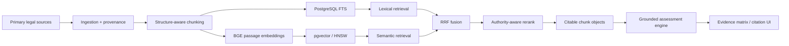

# Lodestar — Grounded RAG / Evidence-Assessment System

> **Working private product with a public technical evidence bundle.**  
> 209 real source documents · 2,945 embedded chunks · 34 hand-checked grounding pairs · **2.9% top-5 retrieval error** · 53 backend tests · 17/17 stress cases · 3/3 browser E2E flows.

[Inspect representative source code and evaluation evidence →](evidence/lodestar/README.md)

## What I built

Lodestar is an AI-assisted evidence-assessment application for EB-2 NIW / EB-1A research. The engineering problem is broader than “build a chatbot”: ingest and version authoritative source material, preserve citation structure, retrieve the right authority, ground downstream reasoning in inspectable chunks, keep candidate/user evidence separate from the source corpus, and fail safely when support is missing.

The working stack includes **Python, FastAPI, PostgreSQL/Supabase, pgvector, local sentence-transformers/BGE embeddings, PostgreSQL full-text retrieval, Reciprocal Rank Fusion, authority-aware reranking, LLM-provider abstraction, Next.js/TypeScript, Playwright and automated backend tests.**

## My role

I designed and iterated the product and technical architecture and work directly on the implementation: retrieval design, chunking strategy, embedding model behavior, database schema, grounding rules, provider abstraction, acceptance criteria, failure handling, test strategy and technical review. AI coding tools are used as implementation accelerators, but architecture decisions and acceptance remain human-controlled.

## System architecture

## Real implementation evidence

| Area | Evidence |
|---|---|
| Corpus | **209 documents / 2,945 chunks**, embedded and searchable |
| Retrieval evaluation | **34 hand-checked query/expected-citation pairs; 2.9% top-5 error** |
| Backend tests | **53 green** |
| Stress / abuse tests | **17 / 17 pass** |
| Browser E2E | **3 / 3 Playwright flows pass** |
| Concurrent stress | **12 / 12 full flows pass** after connection-pool / embedding / fallback hardening |
| Embeddings | Local `BAAI/bge-large-en-v1.5`, **1024 dimensions**, explicit query/passage behavior |
| Vector retrieval | PostgreSQL/Supabase `pgvector`, HNSW cosine ANN |
| Lexical retrieval | Generated `tsvector`, GIN full-text index |
| Fusion | Reciprocal Rank Fusion across lexical + vector candidate lists |
| Domain control | Higher-authority retrieval lanes + authority-aware reranking |
| Grounding | Returned objects preserve chunk ID, citation label, source type, section label, binding metadata, URL and excerpt |

[Open the public technical evidence bundle →](evidence/lodestar/README.md)

## Representative source — public and inspectable

The public evidence bundle contains sanitized versions of actual implementation modules:

- [`legal_chunking.py`](evidence/lodestar/legal_chunking.py) — structure-aware chunking.
- [`embedding_provider.py`](evidence/lodestar/embedding_provider.py) — local embedding provider, provenance and BGE query/passage asymmetry.
- [`hybrid_retrieval.py`](evidence/lodestar/hybrid_retrieval.py) — lexical/vector retrieval, RRF, authority lanes and reranking handoff.
- [`chunks_schema.sql`](evidence/lodestar/chunks_schema.sql) — `pgvector`, HNSW and full-text database layer.
- [`grounding-eval.md`](evidence/lodestar/grounding-eval.md) — current measured grounding result.

That is deliberately more useful than publishing screenshots of prompts.

## Engineering decisions

### Structure first, size second

Statutes, regulations, policy material and decisions are split on their own structure—subsections, headings, criteria and decision issues—before any size cap is applied. The objective is not just embedding convenience; it is preserving a chunk that remains legally meaningful and citable after retrieval.

### The corpus is the asset; vectors are a rebuildable cache

Primary-source documents retain source URL, retrieval/version dates and provenance. Chunk vectors are derived. If the embedding model changes, the architecture calls for a parallel re-index and grounding regression test rather than mixing incompatible vector spaces.

### Hybrid retrieval because similarity is not enough

Lodestar performs both full-text and semantic retrieval. RRF combines rank rather than trying to normalize `ts_rank` and cosine-distance scores onto an invented shared scale.

### Authority is part of retrieval, not a UI badge

Large numbers of non-precedent decisions can be semantically close to a query and crowd primary authority out of a simple vector result set. Lodestar therefore retrieves dedicated high-authority lexical and semantic lanes before fusion, then performs authority-aware reranking.

### Grounding survives the whole pipeline

Retrieved evidence is kept as structured objects with IDs and citation metadata. The assessment layer cannot create a citation that does not resolve back to retrieved evidence; unsupported citations are dropped rather than rendered as plausible-looking text.

## Failures found during hardening

The implementation has already hit—and been changed because of—real engineering failures rather than only happy-path notebook tests:

- remote per-operation database handshakes made an upload trigger roughly 35 connection handshakes;
- concurrent first-use of the embedding model caused initialization races;
- retrieval attempted to initialize a multi-GB embedding model even when the corpus had no vectors yet;
- invalid path IDs could reach SQL instead of failing at the API boundary;
- vector query parameters required an explicit cast for the ANN path.

The current build added connection pooling, batched inserts, model-load locking and warm-up, lexical-only fallback for unembedded corpora, UUID validation and query fixes. The recorded result is **12/12 concurrent full flows** and **17/17 abuse/stress cases** passing.

## Evaluation

The current frozen grounding test uses **34 hand-checked query → expected citation pairs** against **209 documents / 2,945 chunks**. At retrieval depth top-5, the recorded error is **2.9%**.

This is intentionally described as retrieval-grounding evaluation—not “AI accuracy.” The next engineering layer is larger frozen relevance sets, Recall@K/MRR/nDCG, latency percentiles and separate LLM answer-quality evaluation.

[See the grounding-evaluation record →](evidence/lodestar/grounding-eval.md)

## What this demonstrates for an AI Lead Developer role

**RAG engineering:** ingestion, chunking, embedding abstraction, vector persistence, semantic search, full-text retrieval, fusion, reranking, grounding and evaluation.

**Hands-on Python/backend work:** FastAPI, explicit SQL, Postgres/pgvector, provider interfaces and failure handling.

**Production-minded engineering:** migrations, reproducible ingestion, stress tests, E2E tests, concurrency failures, privacy boundaries, fallback modes and deployment design.

**Responsible AI:** authoritative source hierarchy, traceable citations, no invented approval probability and explicit human review where evidence is consequential.

**Architecture judgement:** the system deliberately avoids a heavy agent/RAG framework for its citation-critical retrieval path so the control flow remains readable and auditable.

## Evidence boundary

The full repository remains private because it includes product internals and candidate/user-data structures. The public bundle exposes representative code, schema, measured results and architecture decisions while withholding credentials, private data and product-specific sensitive material.

[Inspect technical evidence →](evidence/lodestar/README.md) · [Back to Applied AI portfolio](README.md)
