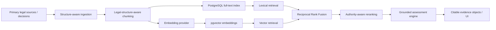

# Case Study — Lodestar: Grounded RAG / Evidence Assessment

## Problem

Build an AI-assisted evidence-assessment system for EB-2 NIW / EB-1A research that can retrieve legal authority, map evidence to criteria, and produce grounded analytical aids **without fabricating scores, approval probabilities, or uncited legal claims**.

This is a private side project. The codebase contains real product and user-data structures, so the implementation is not published wholesale. This page exposes the architecture and technical decisions relevant to an AI engineering review.

## My role

I designed and iterated the product and technical architecture and work directly on the implementation, including retrieval design, chunking strategy, embeddings, database/retrieval behavior, LLM-provider integration, and validation rules. AI-assisted coding tools are used where useful, but the architecture, acceptance criteria, review, and technical decisions remain human-controlled.

## Architecture

## Retrieval implementation

### 1. Structure first, size second

The chunker does not blindly split every N tokens. Statutes, regulations, policy material, and decisions are split on legal structure — subsection markers, headings, numbered/roman sections, and issue boundaries — with a soft size cap used only when structural units become too large.

Why: retrieval quality is not only about semantic similarity. A legally meaningful subsection or decision issue needs to survive as a coherent, citable unit.

### 2. Embeddings with provenance

The embedding layer exposes a provider contract with explicit model name, version, vector dimension, and separate query/passage encoding. The current implementation supports local `sentence-transformers` models and BGE-style asymmetric query instructions.

Each embedded chunk carries the embedding provenance required to explain how an index was produced and when a model change requires re-indexing.

### 3. Vector + lexical retrieval

The retrieval plane uses PostgreSQL/Supabase with:

- `pgvector` embeddings;
- a 1024-dimensional vector column for the current BGE configuration;
- HNSW cosine ANN index;
- generated PostgreSQL `tsvector` full-text index;
- GIN filters for visa class and criterion tags.

### 4. Hybrid retrieval with Reciprocal Rank Fusion

A query runs through lexical and semantic retrieval. Rather than normalize incomparable lexical and cosine-distance scores, the system fuses ranked lists using **Reciprocal Rank Fusion (RRF)**.

It also maintains dedicated higher-authority retrieval lanes so large volumes of non-precedent decisions cannot crowd controlling authority out of the candidate pool simply because they repeat similar vocabulary.

### 5. Grounding survives retrieval

Retrieved chunks remain structured evidence objects carrying identifiers, source type, citation label, section label, authority/binding metadata, URL where available, and an excerpt. The application does not collapse retrieved evidence into anonymous prompt text and then pretend the answer is sourced.

## Production-minded behaviors already implemented

- Backend API in Python/FastAPI.
- PostgreSQL/Supabase persistence.
- Real corpus ingestion and migrations.
- Lazy embedding-model loading to avoid unnecessary heavyweight initialization.
- Dimension validation between model output and the database schema.
- Lexical fallback when embeddings are not yet available.
- Citation resolution from result IDs back to the source object.
- Separate handling and labeling of non-binding decisions.
- Mock/local modes for development without external model calls.
- LLM provider abstraction supporting offline/mock and real provider paths.
- Automated tests around chunking, retrieval, assessment, and API behavior.

## What this project proves for an AI engineering role

**RAG:** not just calling a library — document ingestion, chunking strategy, embeddings, vector persistence, semantic retrieval, lexical retrieval, fusion, reranking, metadata filters, and citation grounding.

**System design:** retrieval behavior is designed around domain failure modes, not around a demo chatbot.

**Responsible AI:** the application deliberately refuses invented probability/score claims and requires retrieved support for legal propositions.

**Product thinking:** offline development modes, database migrations, provider abstraction, UI/API boundaries, testing, and deployment shape are part of the system rather than afterthoughts.

## Known limitations / next engineering steps

- Add a formal retrieval evaluation set with labeled relevant passages and report Recall@K / MRR / nDCG across representative queries.
- Add automated regression evaluation whenever chunking, embedding model, fusion constants, or reranking logic changes.
- Add explicit LLM answer-quality evaluation separate from retrieval quality.
- Harden observability around retrieval latency, embedding-model load time, database query latency, and failure modes.
- Containerize the full production deployment path and add cloud deployment evidence.

Those are important because a RAG system should not be judged by whether a handful of prompts “look good.”

## Evidence boundary

The detailed repository remains private. Architecture and implementation claims on this page are derived from working code in the current project; no immigration outcome prediction, legal advice, or private user evidence is exposed here.
