# TIR-FOD / Clear Run — Operational Edge AI for Runway Safety

> **Public dataset + measured edge deployment + controlled evaluation.**  
> 3,499 source LWIR frames · 5,593 objects · 23 classes · 29 training runs · best observed **0.8603 ± 0.0017 mAP** · TensorRT on Jetson Orin Nano · **25.0 FPS inference / 15.6 FPS end-to-end**.

[Inspect the measured benchmark and deployment evidence →](evidence/tir-fod/README.md)

Public dataset: [TIR-FOD v1.2 — DOI 10.5281/zenodo.22546586](https://doi.org/10.5281/zenodo.22546586)

## Operational problem

Runway Foreign Object Debris (FOD) is a safety and readiness problem. The AI challenge is not simply to detect objects in a curated image folder; it is to build a perception chain that can work with low-light/night imagery, small objects, UAV motion, edge-compute limits, communications and field validation.

The wider Clear Run programme connects **thermal/RGB sensing → onboard AI detection → geolocation / GCS tasking → autonomous ground retrieval**. This page focuses on the perception, evaluation and edge-deployment evidence.

## My role

I lead/supervise the applied R&D and systems integration: problem framing, architecture, dataset/test strategy, model-evaluation direction, deployment requirements, verification logic, field-validation planning and technical review across UAV, sensing, compute, communications, GCS and retrieval interfaces.

## Evidence at a glance

| Area | Measured evidence |
|---|---|
| Dataset | **3,499** source LWIR frames; **5,593** annotated objects; **23** classes |
| Experiment scale | **29** model-training runs across YOLOv8 / YOLO11 / YOLO12 |
| Best observed benchmark | **YOLOv8n: 0.8603 ± 0.0017 mAP** |
| Size-sliced AP | **0.704 / 0.846 / 0.942** small / medium / large |
| Annotation QA | **F1 0.971** representative; **0.645** difficult imagery |
| Leakage experiment | Related derivatives in holdout path produced **+8.52 percentage points invalid uplift** |
| Capture-group generalization | **0.8223 → 0.7410 mAP**, an **8.13-point** reduction when related capture blocks were separated |
| Offline derivative benefit | **+0.67 ± 0.83 points** mean — modest and seed-dependent |
| Edge target | NVIDIA **Jetson Orin Nano**, TensorRT, 640×512 LWIR |
| Flight throughput | **25.0 FPS detector inference / 15.6 FPS complete pipeline** |
| Edge power / thermal | **~17 W**, reported module temperature **55–70 °C** |

[Open the evidence table and engineering interpretation →](evidence/tir-fod/README.md)

## System architecture

```mermaid
flowchart LR
    A[LWIR / RGB sensor] --> B[UAV acquisition]
    B --> C[Source / session grouping]
    C --> D[Dataset + annotation QA]
    D --> E[YOLO experiment matrix]
    E --> F[Leakage / grouping analysis]
    F --> G[TensorRT export]
    G --> H[Jetson Orin Nano]
    H --> I[Detection + geolocation]
    I --> J[GCS display / tasking]
    J --> K[Field validation + failure logging]
```

## The most important technical finding

The useful result is not merely the headline mAP. The controlled experiments show that **dataset partitioning and source similarity can change apparent generalization more than scaling the detector**.

Allowing related derivatives of held-out sources to enter training generated an **invalid +8.52-point uplift**. Separating related acquisition blocks reduced measured mAP from **0.8223 to 0.7410**. That is exactly the sort of failure mode that can make an AI demo look better while making the fielded system less trustworthy.

This is why the project treats data provenance and source grouping as part of the model architecture—not clerical dataset preparation.

## Small objects are treated as their own problem

Aggregate metrics can hide the actual runway challenge. Size-sliced AP is:

- **small: 0.704**
- **medium: 0.846**
- **large: 0.942**

That immediately identifies small-object detection as the dominant remaining perception risk.

## Onboard deployment is measured end-to-end

The detector was exported to TensorRT and exercised onboard a **Jetson Orin Nano** during repeated runway flights at roughly **5–10 m**.

The system reports both:

- **25.0 FPS inference**, and
- **15.6 FPS end-to-end** for the complete inspection chain.

That distinction matters because model FPS is not system FPS. Sensing, memory movement, preprocessing, communications and display all consume the latency budget.

The compute-and-camera subsystem was measured around **17 W** with reported module temperatures in the **55–70 °C** range. The trials also logged misses, false detections and classification errors rather than presenting only best-case frames.

## Published / public research evidence

- **TIR-FOD v1.2 public dataset** — [DOI 10.5281/zenodo.22546586](https://doi.org/10.5281/zenodo.22546586)
- **Low-Latency Architectures for Real-Time Multi-Stream Object Detection**, IEEE ICoDT2 2025 — [DOI 10.1109/ICoDT269104.2025.11360736](https://doi.org/10.1109/ICoDT269104.2025.11360736)
- **TK-Patch: Universal Top-K Adversarial Patches for Cross-Model Person Evasion**, IEEE ICoDT2 2025 — [DOI 10.1109/ICoDT269104.2025.11360694](https://doi.org/10.1109/ICoDT269104.2025.11360694)

The publications reinforce two adjacent capabilities: **low-latency multi-stream perception** and **adversarial / cross-model robustness**.

## What this demonstrates for an AI Lead Developer role

**Applied ML:** dataset design, repeated training experiments, model comparison, leakage analysis, generalization analysis and error slicing.

**Edge AI:** TensorRT, NVIDIA Jetson, real-time throughput constraints, power/thermal considerations and flight integration.

**Multimodal aerospace systems:** LWIR/RGB sensing, UAV operations, communications, GCS workflow and autonomy interfaces.

**Evaluation discipline:** source-aware train/test separation, independent annotation checks, small-object slicing and explicit failure logging.

**Operational engineering:** the AI capability is being developed inside a real end-to-end aviation workflow rather than as an isolated benchmark.

## What remains to prove

I deliberately do not describe the current demonstrator as certified autonomous runway-clearance capability. The next evidence gates are cross-airport/cross-condition validation, scenario-specific miss/false-alarm characterization, checkpoint latency/power/thermal telemetry, small-object improvement, complete UAV→UGV handoff and end-to-end retrieval KPIs.

That is the intended progression: **benchmark → measured edge deployment → controlled field validation → operational evidence.**

[Inspect measured evidence →](evidence/tir-fod/README.md) · [Back to Applied AI portfolio](README.md)
