# Primary user journey and dashboard control audit

**Status:** remediated control contract and release acceptance record

**Audit date:** 2026-09-03; remediation verified 2026-09-06
**Scope:** local dashboard, governed candidate truth, application lifecycle,
feedback incorporation, outcome tracking, and reusable learning

## Product decision

The primary first-run action must be **Establish my career truth**, not **Paste
the job link**.

A job advert is useful only after the system knows which candidate facts it is
allowed to use. The shortest trustworthy path is therefore:

1. upload a base CV;
2. optionally add supporting career artefacts;
3. review extracted facts, conflicts, exclusions, and boundaries;
4. sign off the exact ground-truth digest; and only then
5. paste a job link and enter the application loop.

For a returning user whose ground truth is current, the dashboard should open
directly on working applications. A periodic audit or a material truth change
returns only the affected truth to review; it must not force a full rebuild.

The current dashboard is not merely decorative. Its main application actions
reach real allowlisted operations and produce governed records. The material
defects are missing journeys and dead ends around those operations: first-run
truth creation, evidence updates, feedback implementation, historical stage
tracking, and integrity recovery.

## Evidence and judgment used in this audit

Verified findings are traced to the following implementation surfaces:

- `dashboard/index.html` and `dashboard/app.js` for visible controls and routes;
- `core/dashboard.py` for lifecycle projection, attention routing, and HTTP
  endpoints;
- `core/dashboard_actions.py` for dashboard mutations;
- `jl.py` for command gates and durable writes;
- `core/truth_review.py`, `core/feedback.py`, and `core/learning.py` for truth,
  feedback, and learning semantics;
- `references/onboarding.md`, `references/ground-truth-governance.md`, and
  `references/dashboard.md` for intended behavior.

The proposed workflow and schemas below are product choices. File-type support,
OCR, and any model-assisted extraction method remain implementation decisions
that require threat, privacy, accuracy, and portability tests before release.

## Primary persona and jobs to be done

The primary user is an experienced applicant pursuing a limited number of
high-value roles. They have one or more existing CVs and a mixed collection of
certificates, role descriptions, references, publications, project notes, and
portfolio links. They are willing to verify facts and approve documents, but
should not need to understand JSONL, hashes, application keys, commands, or
folder layout.

They need the product to do five jobs:

1. turn existing career material into a source-backed candidate record quickly;
2. show exactly what is fact, preference, hypothesis, or unknown;
3. tailor an accurate CV and letter to an exact advert;
4. incorporate review feedback into visible document changes before approval;
5. remember submissions and outcomes in a way that improves later decisions
   without inventing causality.

Maintainers and power users may keep CLI access, but the CLI is a recovery and
automation surface, not a prerequisite for the primary journey.

## End-to-end target journey

```mermaid
flowchart LR
  A[Install and launch] --> B{Truth state}
  B -->|Uninitialized| C[Upload base CV and artefacts]
  B -->|Needs review| D[Review affected truth]
  B -->|Ready| G[Working applications]
  C --> E[Extract cited fact candidates]
  E --> D
  D --> F[User signs exact truth digest]
  F --> G
  G --> H[Paste official job link]
  H --> I[Confirm captured advert]
  I --> J[Fit and preflight decisions]
  J --> K[Generate CV and letter]
  K --> L[Review and incorporate feedback]
  L --> M[Approve exact bundle and build]
  M --> N[Submit externally and record exact files]
  N --> O[Record stage events and employer responses]
  O --> P[Challenge hypotheses and retain bounded lessons]
  P --> G
```

### Journey contract

| Step | User action | System action | Durable proof | Failure and recovery |
|---|---|---|---|---|
| 1. Install and launch | Install the skill and open Joblooper | Run installation diagnosis, select/create the private data workspace, and launch the loopback dashboard | Installation receipt plus dashboard health state; no candidate data in the public skill | Explain the exact failed prerequisite and provide one retry; no empty dashboard that looks ready |
| 2. Detect state | Open the dashboard | Derive `UNINITIALIZED`, `SOURCES_REQUIRED`, `EXTRACTION_REVIEW`, `TRUTH_REVIEW`, `TRUTH_READY`, or `TRUTH_BLOCKED` | State derived from workspace files, source inventory, review queue, and truth approval | A contradictory or unreadable state is `TRUTH_BLOCKED`, never silently reset |
| 3. Seed from a base CV | Drop or select the current base CV | Copy the original into private governed storage, hash it, classify it, and scan supported content | Source record with original filename, media type, size, digest, ingestion time, and disposition | Unsupported, encrypted, oversized, or unreadable files remain visible with a precise next action |
| 4. Add supporting evidence | Optionally upload certificates, references, project evidence, older CVs, or notes | Deduplicate by digest; retain each source independently; never merge source authority silently | One source record per file and a source-set digest | Duplicates are linked, not copied into conflicting truth; partial batches can resume safely |
| 5. Extract candidates | Start or accept extraction | Produce proposed atomic facts with exact source citations and confidence/uncertainty labels; do not make them generation authority | Versioned extraction candidates bound to source digests and extractor version | Extraction interruption preserves completed candidates and source state; scanned/OCR uncertainty is explicit |
| 6. Resolve conflicts | Review conflicts, unsupported claims, dates, identity, contact details, and boundaries | Group equivalent facts, surface contradictions, and require an explicit keep/edit/reject/defer decision | Append-only decision events and a remaining-review count | Deferred material facts are excluded from generation; the rest of onboarding can continue |
| 7. Review ground truth | Review a concise candidate profile plus drill-down evidence | Show accepted atomic facts by category, source coverage, omissions, protected inventory, and disclosure boundaries | Review presentation digest | Bulk confirmation is allowed only for visible, source-cited, non-conflicting items |
| 8. Sign off truth | Enter reviewer identity and confirm the exact review | Run integrity checks and bind approval to the exact generation authority | Existing `joblooper.truth-approval.v1` receipt or a compatible successor | Any generation-authority change invalidates sign-off and reopens only affected review items |
| 9. Capture a job | Paste the official URL, or manually paste the complete advert after access failure | Fetch, bound, parse, and stage the exact advert | Raw advert digest, structured JD, source URL, and capture event | Private-network URLs and incomplete pages fail closed; the user can retry or use manual capture |
| 10. Confirm advert | Verify company, title, reference, location, and full-content capture | Present extracted metadata and source completeness before planning | User-confirmed JD-capture receipt | Corrections append an event and invalidate downstream records; no hidden overwrite |
| 11. Fit and preflight | Decide material gaps, identity, eligibility, and whether to proceed | Match only approved truth and omit already-resolved facts | Existing digest-bound preflight record | “Add evidence/context” opens the truth-update workbench at the relevant fact instead of ending in chat |
| 12. Prepare | Generate a tailored application | Deterministically create match, CV, letter, and risk records from exact inputs | Existing plan receipt and records | Retry reuses a current plan; stale or partial records are labelled and rebuilt safely |
| 13. Review and revise | Read complete documents, select text/section, and comment | Classify feedback, propose a before/after change, show evidence and downstream impact, and apply only after user acceptance | Feedback event plus typed change receipt and regenerated plan/presentation digest | Rejection closes with rationale; adopted feedback cannot close on prose alone or strand the user |
| 14. Approve and build | Confirm the six review judgments and reviewer | Bind approval to the exact presentation, then render and verify files | Existing approval, package manifest, and direct artefact links | Interrupted rendering reuses approval; changed content requires a fresh presentation and approval |
| 15. Submit | Upload externally, then select exact sent files and portal evidence | Hash-bind the exact CV/letter and preserve one or more screening artefacts | Submission receipt, application event, and ledger state | Receipt/ledger interruption exposes a completing retry; Joblooper never claims portal submission |
| 16. Track progress | Record every employer stage and exact response | Append observed events such as submitted, screening, interview, progressed, rejected, offer, withdrawn | Stage-event ledger with source, date certainty, and response evidence | Later rejection does not erase an earlier interview; corrections supersede events without deleting them |
| 17. Learn | Review signals and competing explanations | Separate outcome observations, reusable preferences, truth corrections, and causal hypotheses | Inspectable lesson records linked to supporting applications and versions | Small samples, conflicting evidence, and unknown causes remain visible; no automatic truth mutation |
| 18. Maintain truth | Add a new artefact or complete a due audit | Re-extract only changed sources, review affected facts, and renew sign-off | New source/truth/approval digests and change events | Existing application/submission history remains immutable; only dependent future plans become stale |

## Fastest safe ground-truth path

“Quick” must mean low unnecessary effort, not weaker evidence. The dashboard
should optimize the first run as follows:

- Require one base CV as the seed. Supporting material is optional at first and
  can be labelled **review now**, **add later**, or **exclude**.
- Inventory and hash files immediately, then extract in the background while the
  user reviews identity and contact information.
- Present conflicts, uncertain values, unsupported claims, and high-impact facts
  first. Do not make the user re-confirm identical facts one file at a time.
- Keep every extracted fact atomic and cite a page, paragraph, heading, or exact
  source fragment. Extraction output is a proposal, never truth by itself.
- Permit bulk acceptance only for visible, non-conflicting facts from identified
  sources. One action must never accept hidden rows.
- Show a final one-page profile summary with counts for accepted, excluded,
  deferred, conflicting, and uncited items. Allow drill-down before sign-off.
- Sign the exact digest with an explicit reviewer action. A chat response or
  successful extraction is not sign-off.
- On later uploads, re-open only new or affected facts. Preserve all unaffected
  decisions and explain which applications will become stale.

The minimum viable ready state is not “every possible artefact uploaded.” It is
one reviewed source, at least one accepted atomic fact, required identity and
contact data, explicit boundaries, no unresolved blocking conflict, and user
sign-off on the disclosed scope. Missing career areas remain omissions, not
facts inferred by the system.

## Feedback-to-document incorporation contract

Application feedback needs a typed route. A free-form note alone is not an
implementation mechanism.

| Feedback class | Required interaction | Allowed effect | Completion proof |
|---|---|---|---|
| Factual correction | Link the comment to a source-backed fact or request new evidence; review the truth change | Update governed truth, invalidate truth approval, and then regenerate affected work after renewed sign-off | Truth decision event, new truth approval digest, plan digest, and visible document diff |
| Application-specific wording | Anchor the comment to the CV/letter section or selected text; show a proposed replacement | Change only this application's governed document inputs or approved override record | Before/after content digest, accepted proposal, regenerated plan, and current presentation |
| Reusable style preference | Ask whether it applies once, to a role lane, or globally; preview its impact | Add a versioned preference/rule that cannot assert a candidate fact | Preference receipt, scope, tests, affected-plan list, and regenerated presentation |
| Workflow request | Route to a concrete supported action or backlog item | Change workflow state only through an allowlisted operation | Operation/event receipt or explicit “not implemented” disposition |
| Rejected suggestion | Capture why it is not being applied | No content or truth mutation | Append-only rejected resolution with rationale and validation |

Every comment should record target artefact, target version digest, section or
selection, author, text, and requested scope. Adoption should create or refer to
a machine-verifiable change receipt containing affected records, before/after
digests, actor, and validation results. A changed plan digest is useful but not
sufficient evidence that the requested change was the change actually made.

The review surface must then show:

1. original text;
2. proposed text;
3. evidence and rule used;
4. whether career truth, this application, or future applications are affected;
5. accept, edit, reject, and defer actions; and
6. the regenerated complete CV and letter before renewed approval.

## How the system becomes more intelligible

The product needs three explicitly separate forms of memory:

| Memory | Authority | May change generated claims? | Examples |
|---|---|---|---|
| Candidate truth | Source-backed facts plus user sign-off | Yes | roles, dates, achievements, credentials, eligibility |
| User preferences and rules | Explicit user decisions with scope and version | May change selection/wording, never factual content | length, tone, ordering, recurring wording preference |
| Application evidence | Exact submissions, stage events, responses, and challenged hypotheses | May add preflight questions or ranking signals; never silently become truth | similar role progressed, repeated portal question, retained plausible rejection risk |

Learning must consume an append-only stage-event ledger rather than only the
application's latest status. The derived current state can be terminal, while a
separate milestone set preserves that an application reached screening,
interview, or another progression stage before a later rejection.

Reusable signals must expose their source applications, similarity basis,
sample size, conflicts, last validation date, and effect. The user must be able
to inspect, dismiss, narrow, or retire a preference or lesson. No lesson should
be described as the employer's reason unless exact employer evidence says so.

## Baseline dashboard control audit (2026-09-03)

The tables in this section preserve the observed pre-remediation baseline and
the correction that each finding required. They are not the current product
status. The material-defect register and implemented-resolution evidence below
record the post-remediation result.

Status meanings:

- **Sound:** the control performs its stated governed operation and has durable
  evidence plus a usable retry path.
- **Partial:** it performs a real operation, but the end-to-end user job is
  incomplete or the label overstates what can be finished.
- **Display:** intentionally observational; useful when it routes to an action.
- **Defect:** current behavior can strand the user, hide required work, or
  project the wrong lifecycle state.
- **Missing:** required by the target journey but absent.

Routine close, cancel, backdrop, focus-trap, and theme mechanics are included as
shell behavior; they do not replace domain controls.

### First run and ground truth

| Control | Current implementation and durable result | Status | Required correction |
|---|---|---|---|
| First-run state router | No dashboard state machine for uninitialized/source/review stages | Missing | Make truth state the dashboard entry router |
| Upload base CV | No source upload endpoint or UI | Missing | Add bounded private upload, hash, media checks, and resumable source receipt |
| Upload supporting artefacts | No onboarding upload UI; only screening evidence is uploadable | Missing | Add multi-file source inventory with disposition and deduplication |
| Extraction review | Current onboarding is a CLI/Codex-assisted manual data-authoring process | Missing | Add staged extraction candidates with exact citations and uncertainty |
| Conflict resolution | Integrity detects contradictions in governed files, but applicants cannot resolve proposed facts in the dashboard | Missing | Add keep/edit/reject/defer decisions and provenance display |
| Truth summary and sign-off | Backend can audit and digest-bind truth through `onboard finalize`; dashboard shows only readiness/counts | Partial | Add complete review presentation, reviewer confirmation, approval receipt, and affected-item renewal |
| Truth pill and integrity panel | `/api/dashboard` shows readiness and errors; the dialog offers safe explanation and Codex discussion | Partial | Make readiness/audit/source issues actionable; preserve read-only diagnosis as one option |
| Periodic truth audit | Due/overdue data is computed but no dedicated dashboard task completes it | Missing | Add due-soon/overdue attention routes into the truth workbench |
| Add evidence from preflight | “I have evidence that closes it” closes the preflight dialog and opens the governed career-truth workbench with the originating job and question recorded; generation stays blocked until the digest is re-signed | Sound | Keep the resume link back to the exact preflight question |

### Dashboard shell and portfolio

| Control | Current implementation and durable result | Status | Required correction |
|---|---|---|---|
| Global search | Client-side filter over company, role, reference, and ID; no mutation | Sound | Extend to source/truth only when privacy-safe and useful |
| Refresh | Reloads session and governed projection; no mutation | Sound | Keep |
| Theme | Persists browser-local appearance | Sound | Keep; not a workflow control |
| Work with Codex | Starts scoped Codex App Server turns with explicit approvals; chat is not durable authority | Partial | Add typed handoffs from conversation to truth, change proposal, or learning controls |
| New application | URL/manual capture calls real ingest and preflight operations | Partial | On first run, replace with truth setup; when ready, add advert confirmation before planning |
| Hero priority action | Routes to the highest-ranked Attention item | Partial | Ensure each queue item has a completing action and no critical item suppresses independent work |
| Working-application cards | Show eight gates and route to evidence, artefacts, feedback, and next action | Partial | Derive history correctly when unsent derivatives change; add truth/update resumptions |
| KPI cards | Governed projection of application/outcome evidence | Display | Recalculate progression from stage history, not only latest status |
| Lifecycle chart | Shows aggregate milestones | Display | Use preserved milestone events and expose denominators/tooltips |
| Integrity control list | Shows truth, submission, screening, date, and timing coverage | Display | Route each incomplete value to its completing control |
| Ledger search and filters | Client-side filtering and job workspace navigation | Sound | Add explicit archived/withdrawn handling when stage model is implemented |
| Attention queue | Typed routes exist and are tested | Defect | Remove integrity short-circuit; permit multiple independent tasks per job and provide integrity repair |
| Learning memory cards | Displays retained hypotheses with evidential support; a lesson can be marked not-applicable to a job at preflight, which removes it from that plan's carried signals and is traceable in the decision record | Partial | Still to add: source inspection, retire/narrow, and conflict display |

### Job capture through approval

| Control | Current implementation and durable result | Status | Required correction |
|---|---|---|---|
| URL intake | Bounded fetch then structured ingestion and preflight preparation | Partial | Preview/confirm extracted company, title, reference, location, and advert completeness |
| Manual advert intake | Requires company, title, and complete text, then uses the same ingest path | Sound | Add confirmation; retain exact source provenance |
| Official-advert and captured-JD links | Open registered artefacts or original public URL | Sound | Keep |
| Cautions | Dedicated warning control and tab show internal, non-predictive JD-to-evidence risks before the separate document review; stale parser output exposes a governed refresh | Sound | Keep requirement-category labels distinct from match class and never call similarity candidates counterevidence |
| Preflight review | Records structured per-question decisions bound to JD and truth; each item separates the finding about this job, where the concern came from, and the one decision asked, with no internal cause names in user-facing text; the two stop choices route to the truth workbench and each require a brief reason | Sound | Keep the plain-language split; keep internal taxonomy out of the question text |
| Generate/refresh CV and letter | Calls deterministic plan, validates preflight, and verifies complete review records | Sound | Incorporate typed accepted feedback and expose affected inputs |
| Review tab | Loads only the employer-facing CV and letter; internal analysis remains in Cautions while the presentation digest binds both | Sound | Add stable anchors, selection, diff, and comment placement |
| Mark complete bundle presented | Writes presentation receipt bound to exact content | Sound | Keep |
| Evidence tab and gate blockers | Displays match classes and deterministic gate failures | Partial | Route each resolvable blocker to evidence/content proposal; explicitly close unfixable applications |
| Add feedback | Appends scoped feedback and invalidates stale presentation/approval | Partial | Require artefact/version/section anchor where applicable and choose typed disposition |
| Resolve feedback | Appends adopted/rejected rationale and validation | Defect | Add proposal/apply/verify flow; bind resolution to the exact requested change, not merely any changed plan |
| Approve and build | Records exact review judgments and user sign-off, then builds a verified package | Sound | Keep approval and build visibly separate in state and audit receipts |
| Finish build | Reuses a valid approval after interrupted rendering | Sound | Keep |

### Submission, progress, outcomes, and learning

| Control | Current implementation and durable result | Status | Required correction |
|---|---|---|---|
| Submission desk | Selects server-resolved verified artefacts and records exact hashes | Sound | Keep external-portal boundary explicit |
| Screening evidence upload | Accepts one bounded allowlisted file | Partial | Support a bounded ordered set of screenshots/files and per-item hashes |
| Applied date | Optional date is recorded or left null, then Attention asks later | Partial | Require exact date or an explicit unknown/unavailable state at submission time |
| Update dates and portal evidence | Appends correction events without changing sent-file hashes | Sound | Support multi-file evidence and show correction history |
| Record/update outcome | Records status, date/timing, stated reason, and exact pasted response | Partial | Append stage events instead of overwriting one current status; support exact response-file upload |
| Response date | Optional and later surfaced through Attention | Partial | Require date or an explicit unknown state when a response is recorded |
| Reasoning tab | Separates observations, hypotheses, counterevidence, and unknowns | Display | Add governed create/revise/disposition controls; retain Codex as analysis, not storage |
| Timeline | Displays append-only application events | Display | Use it as the canonical stage history and expose corrections/supersession |
| Exact sent CV/letter and decision-case links | Resolve allowlisted registered artefacts | Sound | Keep |
| Package-integrity alert | Shows digest exceptions and blocks downstream mutation | Defect | Add restore, verify-safe-exception, or guided repair paths; do not treat every unsent derivative change as loss of sent history |
| Historical workflow projection | Treats history as complete only when the current package verifies or exact submission verifies through that package | Defect | Verify immutable sent receipts independently and preserve completed historical gates despite later unsent-file changes |
| Progression memory | Similar positive outcomes are selected only from the latest application status | Defect | Derive milestones from stage events so a later rejection cannot erase an interview/progression observation |
| Rejection learning | Enforces competing hypotheses, multiple passes, counterevidence, and unknowns | Sound core, partial UI | Preserve the core; add complete reasoning controls and provenance in the dashboard |

### Codex and permission controls

| Control | Current implementation and durable result | Status | Required correction |
|---|---|---|---|
| Composer and job-scoped turns | Real Codex turn with job context; no implicit approval | Sound | Keep |
| Prepare-language routing | Unambiguous prepare requests call the deterministic prepare action | Sound | Extend typed routing only where a governed target action exists |
| Quick actions | Route to new job, preflight, prepare, review, submission help, feedback discussion, or outcome discussion | Partial | Add onboarding/truth, feedback proposal, and learning disposition destinations |
| Command/file approvals | Allow once, decline, and cancel are presented for Codex requests | Sound | Keep least-privilege behavior |
| Questions and interrupted-turn recovery | Captures answers and reloads durable state before deliberate resume | Sound | Keep |
| Truth/integrity discussion | Bounded read-only explanation | Sound as diagnosis | Pair it with deterministic resolution controls; conversation alone cannot complete the task |

## Material defect register

| ID | Priority | Status | Verified defect | Consequence |
|---|---|---|---|---|
| JF-01 | P0 | Fixed | Dashboard begins at job intake and has no source-to-truth onboarding | The primary persona cannot establish generation authority without developer/manual work |
| JF-02 | P0 | Fixed | Preflight evidence/context choices have no completing dashboard route | A truthful user choice blocks generation and strands the journey |
| JF-03 | P0 | Fixed | Feedback records and resolves prose but cannot propose/apply/verify the requested document change | User feedback is governed as a log, not incorporated as a product workflow |
| JF-04 | P0 | Fixed | Learning reads one mutable latest application status | Later rejection can erase evidence that the exact application previously progressed |
| JF-05 | P0 | Fixed | Historical completion depends on current package verification before exact-submission verification is attempted | A changed unsent derivative can make completed preflight/review/approval look incomplete |
| JF-06 | P1 | Fixed | Package-integrity Attention opens artefacts but has no restore/exception/repair completion | Critical tasks become inspection dead ends |
| JF-07 | P1 | Fixed | Integrity Attention short-circuits all other tasks for the job | Missing dates, screening state, or outcome work can be hidden |
| JF-08 | P1 | Fixed | URL extraction is committed without an applicant confirmation screen | Incorrect metadata or incomplete extraction can enter the workflow before correction |
| JF-09 | P1 | Fixed | One screening file and pasted-text-only employer response are narrower than real portal evidence | Users must preprocess evidence outside the product or omit it |
| JF-10 | P1 | Fixed | Truth audit due state and truth comments have no completing dashboard journey | Ground truth can be correctly blocked but operationally unmaintainable |
| JF-11 | P2 | Fixed | Public release fingerprint changes across otherwise equivalent checkouts | Mirror checks can report false drift, likely from byte/line-ending sensitivity |
| JF-12 | P3 | Fixed | No packaged launcher icon, Start Menu/Desktop shortcut, favicon, or app manifest | Discoverability is weaker, but core job functionality is unaffected |

### Implemented resolution evidence

- **JF-04** — `learning.milestones_reached` derives every stage an application
  reached from the append-only event ledger. `phase` remains the current state;
  milestones are additive history, so a later rejection cannot erase an
  interview, and `relevant_positive_outcomes` reports both.
- **JF-05** — `release.verify_submission` verifies the exact sent-file receipt
  independently of the mutable package, tolerating only unsent employer-facing
  drift. `core/dashboard.py` no longer gates that call behind `package_ready`.
  Errors on a sent file or any non-employer-facing record stay fatal.
- **JF-07** — the per-job `continue` statements are gone. Integrity suppresses
  nothing; a stale analysis still withholds only the lifecycle-gate tasks it
  invalidates. `ATTENTION_KIND_RANK` makes queue order explicit.
- **JF-11** — `check_repo.file_digest` normalizes text to LF, and both
  `release_fingerprint` implementations share it.

**JF-01 is closed.** `truth_review.entry_state()` routes first run into the
dashboard workbench. The workbench now provides bounded multi-file source
upload, source receipts, staged cited candidates, keep/edit/reject/defer review,
conflict handling, truth comments, summary, integrity validation, and exact
digest sign-off. Job capture remains unavailable until that sign-off is current.

### Post-audit correction — JD completeness and caution authenticity

The follow-up evidence review found that normalized job-page text could lose
list markers, that unbulleted lines inside recognized sections were skipped,
and that `Desired Characteristics` was not recognized as a preferred heading.
That combination could make an internally consistent risk packet incomplete.

The correction preserves HTML list markers, reparses sentence-like lines only
inside recognized requirement sections, recognizes the missing heading, and
compares every stored JD analysis with a read-only parse of its exact captured
source. A mismatch is now a critical, completing dashboard task. The prior CV
decision is withdrawn until `refresh-jd`, renewed preflight, planning, and
presentation succeed. Risk semantics now use JD category (`HARD GATE`,
`REQUIRED`, `RESPONSIBILITY`, `PREFERRED`) separately from evidence class, and
nearest anchors are labelled non-proof similarity candidates.

## Prioritized implementation plan

### Phase 0 — Lock the lifecycle contract and repair false history — **complete**

1. ~~Add regression fixtures for multi-stage applications, later rejection,
   submitted-package integrity exceptions, and simultaneous Attention items.~~
2. ~~Introduce an append-only stage-event schema and derive `current_state` plus
   `milestones_reached` from events.~~ Done by reading the existing event
   ledger; no new schema was needed.
3. ~~Verify exact submitted receipts independently of mutable unsent
   derivatives.~~
4. ~~Remove the per-job integrity `continue`; rank multiple tasks without hiding
   them.~~
5. ~~Add a typed integrity resolution state and completing repair UI.~~

**Exit evidence:** historical completed gates remain complete; interview history
survives later rejection; every missing metadata task remains visible; existing
exact-submission hashes remain unchanged. All four are covered by regressions in
`tests/test_release.py`, `tests/test_learning.py` and
 `tests/test_dashboard_journey.py`.

- **JF-01/02/10** — the dashboard now runs source upload, per-claim review,
  truth comments, digest sign-off, scheduled audit renewal and return-to-preflight.
  Each preflight item reads as a finding about this job, a plain-language note of
  where the concern came from, and one decision, with no internal cause names
  shown. A stop choice records a required reason and opens the truth workbench
  bound to the originating job and question; a "does not apply here" choice
  completes preflight and drops that lesson from the plan's carried signals.
- **JF-03** — comments are classified and target-bound; authorized before/after
  wording is applied only through regeneration and closes with a typed receipt.
- **JF-06/08/09/12** — safe integrity states have completing actions; every new
  advert requires exact confirmation; portal/response evidence accepts multiple
  files; a branded favicon and opt-in Windows launchers ship with the skill.

### Phase 1 — Deliver dashboard-first ground truth — **complete**

1. ~~Add first-run state routing~~ (done: `truth_review.entry_state()` gates
   capture) and a **Set up career truth** workspace.
2. Add bounded multi-file source upload with private storage, deduplication,
   allowlisted media types, digest receipts, and explicit source disposition.
3. Add staged extraction candidates with source anchors, uncertainty, parser
   version, and no authority until reviewed.
4. Add conflict/identity/boundary review and a concise truth summary.
5. Expose truth comments, affected-item review, audit due state, and exact
   digest sign-off in the dashboard.
6. Redirect preflight evidence/context choices into this workspace and resume
   the originating question afterwards.

**Exit evidence:** a clean user can install, launch, upload a base CV, review and
sign truth, paste a job URL, and reach preflight without using a terminal or
editing governed files.

### Phase 2 — Make feedback incorporation real — **complete**

1. Add stable document/section/selection anchors to comments.
2. Require classification as factual correction, application wording,
   reusable preference/rule, workflow request, or rejection.
3. Add a change-proposal record with before/after content, evidence, scope, and
   affected documents.
4. Implement accept/edit/reject/defer controls and deterministic application of
   supported changes.
5. Bind resolution to a typed change receipt and validation output.
6. Regenerate and show the full diff plus complete documents before approval.

**Exit evidence:** an applicant can comment on a CV sentence, accept a proposed
change, see that exact change in both the diff and regenerated bundle, and
approve it; truth and global-rule feedback take their separate governed paths.

### Phase 3 — Complete tracking and cumulative learning — **complete**

1. Render and edit stage history from append-only events.
2. Support multiple portal-evidence files and response-file ingestion.
3. Require explicit exact/unknown states for submission and response dates.
4. Add dashboard controls for hypothesis creation, revision, disposition, and
   source inspection.
5. Add a governed preference store distinct from truth and outcome learning.
6. Show why each reusable signal was selected and let the user narrow, dismiss,
   or retire it.

**Exit evidence:** the next application can show which exact prior submissions
progressed, which preferences the user adopted, which rejection risks remain
plausible, and how each signal affected preflight or drafting.

### Phase 4 — Harden capture, recovery, and public mirroring — **complete in code; release verification required for each publish**

1. Add advert confirmation/correction receipts.
2. Add deterministic integrity repair choices: restore authoritative bytes,
   register an intentional evidence revision, or acknowledge a proven-safe
   unsent-derivative exception.
3. Make release fingerprints checkout/line-ending independent and add a
   cross-clone mirror regression test.
4. Run full private checks, sanitize into a separate public clone, inspect the
   generated diff, run public checks, and publish separate histories.

**Exit evidence:** every Attention route has a tested completion, private data
never appears in the public tree, and equivalent private/public code produces a
stable release fingerprint.

### Phase 5 — Launcher and icon convenience — **complete**

1. Add an app icon/favicon and optional local manifest.
2. Provide an explicit installer option for a Start Menu shortcut and an
   opt-in Desktop shortcut that launches the canonical dashboard command.
3. Keep CLI and ordinary skill discovery working without the shortcut.

**Exit evidence:** uninstall/update is documented, shortcuts never embed
credentials or personal paths in the public package, and launch health is still
verified through the loopback dashboard endpoint.

## Release order and non-negotiable gates

Implementation order is Phase 0, Phase 1, Phase 2, Phase 3, Phase 4, then Phase
5. Icon work must not displace the application workflow.

Each phase must satisfy these gates before private/public release:

- no browser action bypasses truth integrity, presentation, approval, or exact
  submission binding;
- every mutating control has a precondition, typed durable write, visible
  postcondition, idempotent retry behavior, and regression test;
- every conversational suggestion that should affect future work is promoted
  through a typed governed control, never by chat history alone;
- failure preserves prior valid evidence and states the next recoverable action;
- fixtures are fictional and public export contains no personal data;
- the private repository remains authoritative and the public repository is
  updated only through the sanitized export workflow with separate history.

## Paused release and independent-review checkpoint — 2026-09-06

The remediation is implemented and locally verified, but publication is
deliberately paused at the user's request so the user can ask Claude directly.
No private or public commit/push, dashboard restart, or shortcut installation
was performed at this checkpoint.

### Verified observations

- The staged product change covers 44 files: dashboard-first truth intake,
  advert confirmation, typed feedback/preferences, append-only outcomes and
  corrections, multi-file portal/response evidence, package recovery, source
  supersession, public-release attestation, and opt-in Windows launchers.
- `python tools/run_checks.py full` completed successfully. This included the
  deterministic generation and adversarial gates, truth/preflight controls,
  release integrity, learning, locking, 67 dashboard invariants, 23 complete
  dashboard journey touchpoints, browser automation, standalone installation,
  repository policy, privacy scanning, and mirror drift.
- A scratch public export contained 102 allowlisted files and passed the public
  privacy scanner. The unrelated personal PNG in `assets/` was not selected;
  only `assets/joblooper.ico.b64` is allowlisted.
- GitHub authentication was verified outside the restricted process. No remote
  mutation was attempted after verification.
- The temporary audit export was removed after checks. The private
  `.joblooper/index/public_export.json` baseline was updated locally but remains
  uncommitted pending the actual two-repository publish sequence.

### Independent Claude review status

The user approved sending a frozen, privacy-limited audit bundle containing the
staged product scope, selected high-risk excerpts, passing test evidence, known
constraints, and the rubric below. Private runtime records, candidate identity,
career facts, generated applications, credentials, environment dumps, and
unrelated personal assets were excluded.

Two dispatch attempts reached the Claude CLI but were rejected before content
review with HTTP 429: `Usage credits are required for this model` for
`claude-fable-5`. Both attempts consumed zero input/output tokens, produced no
review findings or rubric results, and left the repository snapshot unchanged.
Accordingly, there is no independent verdict and no reviewer-suggested fix was
applied.

### User-approved external review rubric

1. Unsubmitted-package repair requires exact confirmation, targets only the
   resolved private package, and refuses submitted packages.
2. Submitted CVs, cover letters, receipts, hashes, and employer evidence remain
   immutable during repair and exception acknowledgement.
3. Failed recovery operations preserve authoritative plans and leave a clear,
   retryable state without silent data loss.
4. Source supersession retains history and succeeds only after every active
   fact has alternative reviewed evidence.
5. Upload failures remove only Joblooper-created temporary files; accepted
   source evidence is never accidentally deleted.
6. Shortcut removal targets only Joblooper's known shortcuts/icon and cannot
   delete broader directories or user files.
7. All destructive targets are path-bounded, validated before deletion, and
   covered by regression tests.
8. Public export contains no candidate data, private runtime records,
   credentials, or unrelated personal assets.
9. Private/public synchronization remains independently verifiable through
   fingerprints, clean-clone checks, and remote attestation.

### Open verification items before publication

- Obtain and evaluate an independent review against all nine rubric items, or
  explicitly record a decision to publish without it.
- A real Windows shortcut has not been created during automated verification;
  only syntax, packaged icon, CLI options, and standalone installation were
  tested. Shortcut installation remains opt-in.
- After review resolution, rerun the proportional/full checks if code changes,
  then commit and push private, update a separate canonical public clone only
  through the sanitizer, run public checks, push public, attest the remote
  public commit, and commit/push the resulting private attestation.
